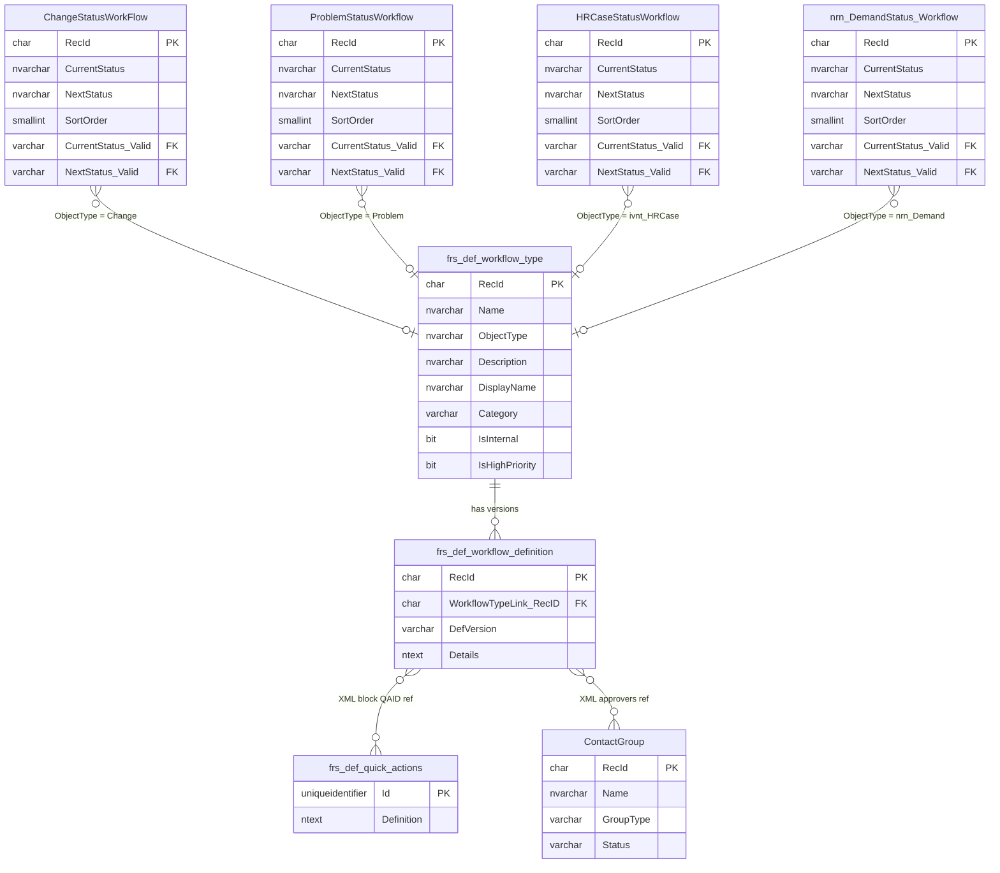

# BO Workflow Attributes — ER Diagram & Table Descriptions

## Entity Relationship Diagram



---

## How BO Workflows Differ from RO Workflows

| Aspect | RO Workflows | BO Workflows |
|---|---|---|
| **ObjectType** | `ServiceReq` | Incident, Change, Problem, CI, Employee, etc. |
| **Link to business record** | Via `FusionLink` → `ServiceReqFulfillmentPlan` | Via `ObjectType` naming convention |
| **Status transitions** | Managed by RO status field | Defined in `*StatusWorkFlow` tables |
| **Trigger** | Submitted when end user fills out form | Triggered by business object events or status changes |
| **Naming pattern** | `"{RO Name} Request form"` | Descriptive names (e.g. `Change Approval Workflow`) |

---

## Table Descriptions

### `frs_def_workflow_type`
**Workflow Type Definition — Central Table**

Defines every workflow in the system. The `ObjectType` column is the key field that identifies which business object (Incident, Change, Problem, etc.) the workflow belongs to. Each row is one named workflow type.

| Column | Type | Description |
|---|---|---|
| `RecId` | char(32) | Primary key |
| `Name` | nvarchar(200) | Workflow name (e.g. `Change Approval Workflow`) |
| `ObjectType` | nvarchar(100) | The business object this workflow belongs to — see table below |
| `Description` | nvarchar(125) | Brief description of the workflow's purpose |
| `DisplayName` | nvarchar(250) | Display name shown in the UI |
| `Category` | varchar(25) | `User` or `System` |
| `IsInternal` | bit | Whether the workflow is system-internal |
| `IsHighPriority` | bit | Whether the workflow runs at high priority |

**Key ObjectType values:**

| ObjectType | Business Object |
|---|---|
| `ServiceReq` | Request Offering (RO) — covered by RO Workflow Query |
| `Incident` | Incident management |
| `Change` | Change management |
| `Problem` | Problem management |
| `CI` | Configuration Item |
| `CI.Computer` | Computer CI |
| `CI.MobileDevice` | Mobile device CI |
| `Employee` | Employee records |
| `ivnt_SecurityIncident` | Security Incident |
| `ivnt_HRCase` | HR Case |
| `ivnt_WorkOrder` | Work Order |
| `ivnt_GRCAudit` | GRC Audit |
| `GRC_Policy` | GRC Policy |
| `GRC_Exception` | GRC Exception |
| `FRS_Knowledge.*` | Knowledge Management (Document, Patch, Q&A, etc.) |
| `ReleaseMilestone` | Release Milestone |
| `ReleaseProject` | Release Project |
| `Frs_Project` | Project management |
| `nrn_Demand` | Demand management |
| `ScheduleEntry` | Scheduled / automated workflows |
| `Task.*` | Task workflows (Assignment, SoftwareInstallation, etc.) |

---

### `frs_def_workflow_definition`
**Workflow Definition — Contains All Block Configuration**

Each row is one version of a workflow. The `Details` column contains the full workflow as XML — every block, its type, title, properties, and team/approval references. Multiple rows exist per workflow type (one per version); the app always queries the latest using `ROW_NUMBER()` partitioned by `WorkflowTypeLink_RecID`.

| Column | Type | Description |
|---|---|---|
| `RecId` | char(32) | Primary key |
| `WorkflowTypeLink_RecID` | char(32) | FK → `frs_def_workflow_type.RecId` |
| `DefVersion` | varchar(50) | Version number — higher = newer. Cast to INT for ordering |
| `Details` | ntext | Full workflow XML — all blocks, types, properties, and references |

**XML block structure inside `Details`:**
```xml
<scenario>
  <blocks>
    <block>
      <id>...</id>
      <type>update</type>
      <title>Update Record</title>
      <blockProperties>
        <property>
          <name>QuickAction</name>
          <!-- QAID references frs_def_quick_actions.Id -->
          <groups><group><param><name>QAID</name><value>{guid}</value></param></group></groups>
        </property>
        <property>
          <name>teamblock</name>
          <!-- Direct team assignment -->
          <groups><group><param><name>team</name><value>Team Name</value></param></group></groups>
        </property>
        <property>
          <name>approvers</name>
          <!-- References ContactGroup.RecId -->
          <groups><group><param><name>contactgroup</name><value>{guid}</value></param></group></groups>
        </property>
      </blockProperties>
    </block>
  </blocks>
</scenario>
```

**Cardinality:** One `frs_def_workflow_type` → many `frs_def_workflow_definition` (versions)

---

### `frs_def_quick_actions`
**QuickAction Definitions**

Reusable action blocks referenced from workflow XML by QAID (a GUID). The `Definition` column is JSON containing field mappings, expressions, and the `OwnerTeam` used to determine team assignment for `update`, `quickaction`, and `advancedtask` blocks.

| Column | Type | Description |
|---|---|---|
| `Id` | uniqueidentifier | Primary key — GUID, referenced in workflow block XML |
| `Definition` | ntext | Full QuickAction JSON — contains `OwnerTeam`, field updates, and expressions |

**How team is extracted from `Definition`:**
```sql
CHARINDEX('"FieldName":"OwnerTeam","ExpressionText":"', CONVERT(nvarchar(max), Definition))
-- The value immediately following that position is the team name
```

---

### `ContactGroup`
**Teams and Approval Groups**

Used for approval workflow blocks (`vote`, `vote0007`). The app filters to `GroupType = 'Service Request Approval'` and `Status = 'Active'` to resolve approval group GUIDs from block XML to readable team names.

| Column | Type | Description |
|---|---|---|
| `RecId` | char(32) | Primary key — referenced in workflow XML as an uppercase GUID |
| `Name` | nvarchar | Group/team display name |
| `GroupType` | varchar | `Service Request Approval`, `Standard`, etc. |
| `Status` | varchar | `Active`, `Inactive` |

---

### `ChangeStatusWorkFlow`
**Change Object Status Transitions**

Defines the allowed status transitions for Change records. Each row represents one valid `CurrentStatus → NextStatus` move. Does not directly reference `frs_def_workflow_definition` via a FK — the connection is through the `ObjectType = 'Change'` convention in `frs_def_workflow_type`.

| Column | Type | Description |
|---|---|---|
| `RecId` | char(32) | Primary key |
| `CurrentStatus` | nvarchar(60) | The status the Change is currently in |
| `NextStatus` | nvarchar(60) | The status the Change can transition to |
| `SortOrder` | smallint | Display order of the transition |
| `CurrentStatus_Valid` | varchar(32) | FK → validation list for CurrentStatus |
| `NextStatus_Valid` | varchar(32) | FK → validation list for NextStatus |

**Example transitions:** `Logged → Requested`, `Requested → Pending Approval`, `Pending Approval → Scheduled`, `Scheduled → Implemented`, `Implemented → Closed`

---

### `ProblemStatusWorkflow`
**Problem Object Status Transitions**

Same structure as `ChangeStatusWorkFlow` but for Problem records.

| Column | Type | Description |
|---|---|---|
| `RecId` | char(32) | Primary key |
| `CurrentStatus` | nvarchar(60) | Current Problem status |
| `NextStatus` | nvarchar(60) | Target status |
| `SortOrder` | smallint | Display order |

---

### `HRCaseStatusWorkflow`
**HR Case Status Transitions**

Same structure as `ChangeStatusWorkFlow` but for HR Case records (`ObjectType = 'ivnt_HRCase'`).

---

### `nrn_DemandStatus_Workflow`
**Demand Status Transitions**

Same structure as `ChangeStatusWorkFlow` but for Demand records (`ObjectType = 'nrn_Demand'`).

---

### Other `*StatusWorkflow` Tables

The following tables follow the same structure as `ChangeStatusWorkFlow` and define status transitions for their respective business objects:

| Table | Business Object |
|---|---|
| `GRCPolicyStatusWorkflow` | GRC Policy |
| `nrn_EmergencyPlanStatusWorkflow` | Emergency Plan |
| `nrn_GRCAuditStatusWorkflow` | GRC Audit |
| `nrn_GRCControlStatusWorkflow` | GRC Control |
| `nrn_GRCEvidenceStatusWorkFlow` | GRC Evidence |
| `nrn_PPM_PortfolioStatusWorkflow` | PPM Portfolio |
| `nrn_PPM_ProgramStatusWorkflow` | PPM Program |
| `nrn_PPM_ProjectStatusWorkflow` | PPM Project |
| `nrn_StrategicObjectiveStatusWorkflow` | Strategic Objective |

---

## How the Tables Connect — End to End

```
frs_def_workflow_type (the workflow definition)
│   RecId ────────────────────────────────────────────────────┐
│   ObjectType = "Incident" / "Change" / "Problem" / etc.     │
│                                                              │
└── frs_def_workflow_definition (versioned workflow XML)       │
      WorkflowTypeLink_RecID ──► frs_def_workflow_type ◄───────┘
      DefVersion (latest = highest INT value)
      Details (XML — shredded at query time)
            │
            ├── Block type="update/quickaction/advancedtask"
            │     QAID ──► frs_def_quick_actions.Id
            │               Definition (JSON)
            │               └── OwnerTeam = "Team Name"
            │
            ├── Block type="task"
            │     teamblock.team = "Team Name"
            │
            └── Block type="vote/vote0007"
                  approvers.contactgroup ──► ContactGroup.RecId
                                              └── Name = "Approval Group"

Business Object Status Transitions (separate concern):
  ChangeStatusWorkFlow      → CurrentStatus / NextStatus for Change records
  ProblemStatusWorkflow     → CurrentStatus / NextStatus for Problem records
  HRCaseStatusWorkflow      → CurrentStatus / NextStatus for HR Case records
  nrn_DemandStatus_Workflow → CurrentStatus / NextStatus for Demand records
  (+ 9 more *StatusWorkflow tables)
```

---

## Key SQL Patterns

### Get All BO Workflows (Excluding RO)
```sql
SELECT wt.Name, wt.ObjectType, wf.DefVersion
FROM frs_def_workflow_type wt
JOIN frs_def_workflow_definition wf ON wf.WorkflowTypeLink_RecID = wt.RecID
WHERE wt.ObjectType <> 'ServiceReq'
  AND wt.Name NOT LIKE '%backup%'
```

### Get Latest Version of Each Workflow
```sql
;WITH Latest AS (
    SELECT *, ROW_NUMBER() OVER (
        PARTITION BY WorkflowTypeLink_RecID
        ORDER BY TRY_CAST(DefVersion AS INT) DESC
    ) AS rn
    FROM frs_def_workflow_definition
)
SELECT * FROM Latest WHERE rn = 1
```

### Shred Blocks from Workflow XML
```sql
CROSS APPLY XmlData.nodes('/scenario/blocks/block') b(block)
CROSS APPLY (VALUES (
    LTRIM(RTRIM(b.block.value('(type)[1]',  'nvarchar(50)'))),
    LTRIM(RTRIM(b.block.value('(title)[1]', 'nvarchar(255)')))
)) bt(BlockType, BlockTitle)
```

### Distinct ObjectTypes with Workflow Counts
```sql
SELECT ObjectType, COUNT(DISTINCT RecId) AS WorkflowCount
FROM frs_def_workflow_type
WHERE ObjectType <> 'ServiceReq'
GROUP BY ObjectType
ORDER BY WorkflowCount DESC
```
