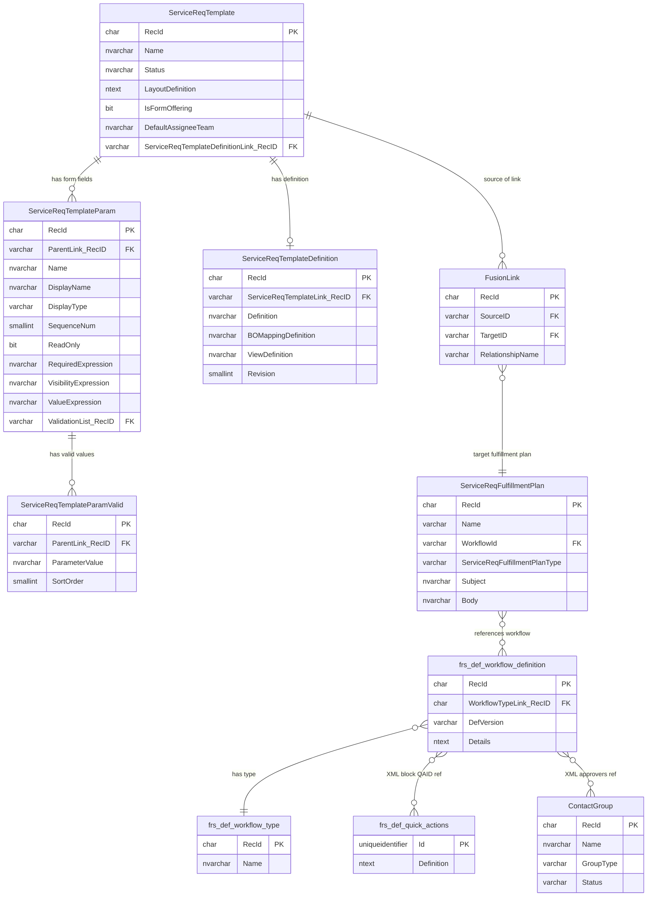

# ER Diagram — RO Workflow & Attribute Query Tables

## Entity Relationship Diagram



---

## Table Descriptions

### `ServiceReqTemplate`
**The Request Offering (RO)**

The central table. Each row is one request offering visible in the Ivanti Service Catalog.

| Column | Type | Description |
|---|---|---|
| `RecId` | char(32) | Primary key — GUID without dashes |
| `Name` | nvarchar(150) | Display name of the offering |
| `Status` | nvarchar(32) | `Published (Automatic)`, `Design`, `Retired`, `Draft` |
| `LayoutDefinition` | ntext | JSON/XML describing the form layout |
| `IsFormOffering` | bit | Whether the RO uses a custom form |
| `DefaultAssigneeTeam` | nvarchar(100) | Default team for assignment |
| `ServiceReqTemplateDefinitionLink_RecID` | varchar(32) | FK → `ServiceReqTemplateDefinition` |

**Linked from:** `ServiceReqTemplateParam`, `ServiceReqTemplateDefinition`, `FusionLink`

---

### `ServiceReqTemplateParam`
**Form Fields on the RO**

Each row is one field on the request offering's submission form. Linked to `ServiceReqTemplate` via `ParentLink_RecID`.

| Column | Type | Description |
|---|---|---|
| `RecId` | char(32) | Primary key |
| `ParentLink_RecID` | varchar(32) | FK → `ServiceReqTemplate.RecId` |
| `Name` | nvarchar(100) | Internal field name (e.g. `Customer_Email`) |
| `DisplayName` | nvarchar(200) | Label shown to the submitter |
| `DisplayType` | varchar(32) | Field type: `text`, `combo`, `textarea`, `checkbox`, `date`, etc. |
| `SequenceNum` | smallint | Display order on the form |
| `ReadOnly` | bit | Whether the field is read-only |
| `RequiredExpression` | varchar(2000) | Ivanti expression for when field is required |
| `VisibilityExpression` | nvarchar(2000) | Ivanti expression for when field is visible |
| `ValueExpression` | nvarchar(max) | Auto-fill expression |
| `ValidationList_RecID` | varchar(32) | FK → validation list for combo fields |

**Cardinality:** One `ServiceReqTemplate` → many `ServiceReqTemplateParam`

---

### `ServiceReqTemplateParamValid`
**Valid Values for Combo Fields**

Each row is one selectable option in a dropdown (`combo`) field. Linked to `ServiceReqTemplateParam` via `ParentLink_RecID`.

| Column | Type | Description |
|---|---|---|
| `RecId` | char(32) | Primary key |
| `ParentLink_RecID` | varchar(32) | FK → `ServiceReqTemplateParam.RecId` |
| `ParameterValue` | nvarchar(150) | The selectable value |
| `SortOrder` | smallint | Display order in the dropdown |

**Cardinality:** One `ServiceReqTemplateParam` → many `ServiceReqTemplateParamValid`

---

### `ServiceReqTemplateDefinition`
**Business Object Mapping & View Definition**

Contains the technical definition of how the RO maps to the underlying business object. Linked 1:1 to `ServiceReqTemplate`.

| Column | Type | Description |
|---|---|---|
| `RecId` | char(32) | Primary key |
| `ServiceReqTemplateLink_RecID` | varchar(32) | FK → `ServiceReqTemplate.RecId` |
| `Definition` | nvarchar(max) | JSON/XML definition of field mappings |
| `BOMappingDefinition` | nvarchar(max) | Business object field mapping |
| `ViewDefinition` | nvarchar(max) | View layout definition |
| `Revision` | smallint | Revision number |

**Cardinality:** One `ServiceReqTemplate` → one `ServiceReqTemplateDefinition`

---

### `FusionLink`
**Generic Relationship Table**

Ivanti's universal many-to-many link table. Connects any two records using `SourceID`, `TargetID`, and a `RelationshipName`. Used to link ROs to their fulfillment plans.

| Column | Type | Description |
|---|---|---|
| `RecId` | char(32) | Primary key |
| `SourceID` | varchar(32) | FK — the source record (e.g. `ServiceReqTemplate.RecId`) |
| `TargetID` | varchar(32) | FK — the target record (e.g. `ServiceReqFulfillmentPlan.RecId`) |
| `RelationshipName` | varchar | Describes the relationship type |

**Key relationship used by these apps:**

| RelationshipName | Source | Target |
|---|---|---|
| `ServiceReqTemplateAssociatedServiceReqFulfillmentP` | `ServiceReqTemplate` | `ServiceReqFulfillmentPlan` |
| `ServiceReqTemplateAssociatedServiceReqCategory` | `ServiceReqTemplate` | Category record |
| `ServiceReqTemplateAssociatedServiceLevelPackage` | `ServiceReqTemplate` | SLA package |

---

### `ServiceReqFulfillmentPlan`
**RO Fulfillment Plan — Links RO to Workflow**

Defines how an RO is fulfilled. The critical column is `WorkflowId`, which points to the workflow definition that runs when the RO is submitted.

| Column | Type | Description |
|---|---|---|
| `RecId` | char(32) | Primary key |
| `Name` | varchar(100) | Fulfillment plan name |
| `WorkflowId` | varchar(50) | FK → `frs_def_workflow_definition.RecID` |
| `ServiceReqFulfillmentPlanType` | varchar(30) | Type of fulfillment (e.g. workflow, email) |
| `Subject` | nvarchar(255) | Email subject (for email-type plans) |
| `Body` | nvarchar(2000) | Email body (for email-type plans) |

**Cardinality:** One `ServiceReqTemplate` → one `ServiceReqFulfillmentPlan` (via `FusionLink`) → one or more versions in `frs_def_workflow_definition`

---

### `frs_def_workflow_definition`
**Workflow Definition — Contains All Block Configuration**

Each row is one version of a workflow. The `Details` column holds the entire workflow as XML, including every block, its type, title, properties, and team assignments.

| Column | Type | Description |
|---|---|---|
| `RecId` | char(32) | Primary key |
| `WorkflowTypeLink_RecID` | char(32) | FK → `frs_def_workflow_type.RecId` |
| `DefVersion` | varchar(50) | Version number — higher = newer |
| `Details` | ntext | Full workflow XML — all blocks, types, properties, and team refs |

**Important:** Multiple rows can exist per workflow (one per version). Apps always query `ORDER BY CAST(DefVersion AS INT) DESC` and take `TOP 1` to get the latest.

**XML structure inside `Details`:**
```xml
<scenario>
  <blocks>
    <block>
      <type>update</type>
      <title>Update SR</title>
      <blockProperties>
        <property>
          <name>QuickAction</name>
          <groups>
            <group>
              <param><name>QAID</name><value>{guid}</value></param>
            </group>
          </groups>
        </property>
        <property>
          <name>teamblock</name>
          <groups>
            <group>
              <param><name>team</name><value>TeamName</value></param>
            </group>
          </groups>
        </property>
      </blockProperties>
    </block>
  </blocks>
</scenario>
```

---

### `frs_def_workflow_type`
**Workflow Type Name**

Lookup table giving each workflow a human-readable name. RO workflows follow the naming pattern: `"{Offering Name} Request form"`.

| Column | Type | Description |
|---|---|---|
| `RecId` | char(32) | Primary key |
| `Name` | nvarchar | Workflow type name (e.g. `Certificate Request Request Form`) |

---

### `frs_def_quick_actions`
**QuickAction Definitions**

Each row is a QuickAction — a reusable action block that can update fields, assign teams, send notifications, etc. Referenced from workflow block XML by `QAID`. The `Definition` column is JSON and contains the `OwnerTeam` field used to determine team assignment.

| Column | Type | Description |
|---|---|---|
| `Id` | uniqueidentifier | Primary key — GUID |
| `Definition` | ntext | Full QuickAction JSON — contains `OwnerTeam`, field mappings, etc. |

**How team is extracted:**
```
CHARINDEX('"FieldName":"OwnerTeam","ExpressionText":"', Definition)
→ substring after that position = team name
```

---

### `ContactGroup`
**Teams and Approval Groups**

Used for approval workflow blocks (`vote`, `vote0007`). The app filters to `GroupType = 'Service Request Approval'` and `Status = 'Active'` to resolve approval group GUIDs from block XML to readable team names.

| Column | Type | Description |
|---|---|---|
| `RecId` | char(32) | Primary key — referenced by approval block XML as uppercase GUID |
| `Name` | nvarchar | Group/team name |
| `GroupType` | varchar | `Service Request Approval`, `Standard`, etc. |
| `Status` | varchar | `Active`, `Inactive` |

---

## How the Tables Connect — End to End

```
ServiceReqTemplate (the RO)
│   RecId ──────────────────────────────────────────────────┐
│                                                            │
├── ServiceReqTemplateParam (form fields)                    │
│     ParentLink_RecID ──► ServiceReqTemplate.RecId          │
│     └── ServiceReqTemplateParamValid (dropdown values)     │
│           ParentLink_RecID ──► ServiceReqTemplateParam     │
│                                                            │
├── ServiceReqTemplateDefinition (BO mapping)                │
│     ServiceReqTemplateLink_RecID ──► ServiceReqTemplate    │
│                                                            │
└── FusionLink (relationship bridge)                         │
      SourceID ──► ServiceReqTemplate.RecId ◄────────────────┘
      RelationshipName = 'ServiceReqTemplateAssociated...'
      TargetID ──► ServiceReqFulfillmentPlan.RecId
                        │
                        │ WorkflowId
                        ▼
              frs_def_workflow_definition (workflow XML)
                        │
                        ├── WorkflowTypeLink_RecID ──► frs_def_workflow_type
                        │                               (workflow name)
                        │
                        └── Details (XML — shredded at query time)
                              │
                              ├── Block type="update/quickaction/advancedtask"
                              │     QAID ──► frs_def_quick_actions.Id
                              │               Definition (JSON)
                              │               └── OwnerTeam = "Team Name"
                              │
                              ├── Block type="task"
                              │     teamblock.team = "Team Name"
                              │
                              └── Block type="vote/vote0007"
                                    approvers.contactgroup ──► ContactGroup.RecId
                                                                └── Name = "Approval Group"
```

---

## Key Join Patterns Used in the Apps

### RO → Form Fields
```sql
SELECT srt.Name, p.DisplayName, p.DisplayType
FROM ServiceReqTemplate srt
JOIN ServiceReqTemplateParam p ON p.ParentLink_RecID = srt.RecId
```

### RO → Workflow (via FusionLink)
```sql
SELECT srt.Name, fp.WorkflowId
FROM ServiceReqTemplate srt
JOIN FusionLink fl
    ON  fl.SourceID         = srt.RecId
    AND fl.RelationshipName = 'ServiceReqTemplateAssociatedServiceReqFulfillmentP'
JOIN ServiceReqFulfillmentPlan fp ON fp.RecId = fl.TargetID
```

### Workflow → Latest Version
```sql
SELECT TOP 1 wt.Name, wf.Details
FROM frs_def_workflow_definition wf
JOIN frs_def_workflow_type wt ON wt.RecID = wf.WorkflowTypeLink_RecID
WHERE UPPER(wf.RecID) = UPPER(@WorkflowId)
ORDER BY TRY_CAST(wf.DefVersion AS INT) DESC
```

### Workflow Block XML → Team (QuickAction path)
```sql
CROSS APPLY wf.XmlData.nodes('/scenario/blocks/block') b(block)
JOIN frs_def_quick_actions qa ON qa.Id = TRY_CAST(
    b.block.value('(blockProperties/property[name="QuickAction"]/groups/group/param[name="QAID"]/value)[1]', 'nvarchar(100)')
AS uniqueidentifier)
-- Extract OwnerTeam from JSON
CROSS APPLY (VALUES (CHARINDEX('"FieldName":"OwnerTeam","ExpressionText":"', CONVERT(nvarchar(max), qa.Definition)))) cp(pos)
```
